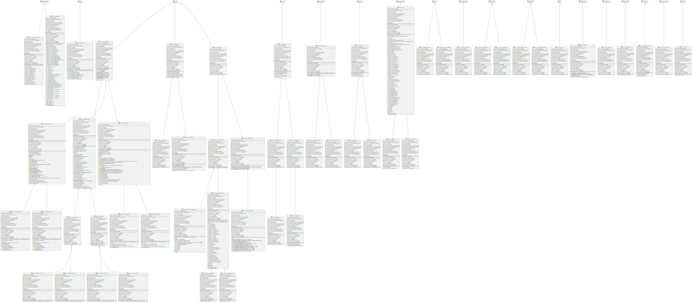

# Syetemverilog2Plantuml

Using regex， extracting class、function/task、property and constraint to form plantuml code.
This program only for self using without rigorous testing, which means that you need fix code depending on your situation.

## Using

Change `folder_path` to the Systemverilog code folder defined in funtion `main()`, and directly run.
It will recursively search all sv files with `.svh` suffix and will ignore `toptb.sv` code.

The plantuml code will print in console.
Paste plantuml code to the editor on the [plantuml](https://www.plantuml.com/plantuml) website.

if the row number of the generated plantuml code is more than 1000 rows, the on-line version plantuml might not be avaible. So that you need use local server, which you can find user guide on the [plantuml](https://www.plantuml.com/plantuml) website.

## Example

Using [tvip-axi](https://github.com/taichi-ishitani/tvip-axi/) and generate following class structure.

.